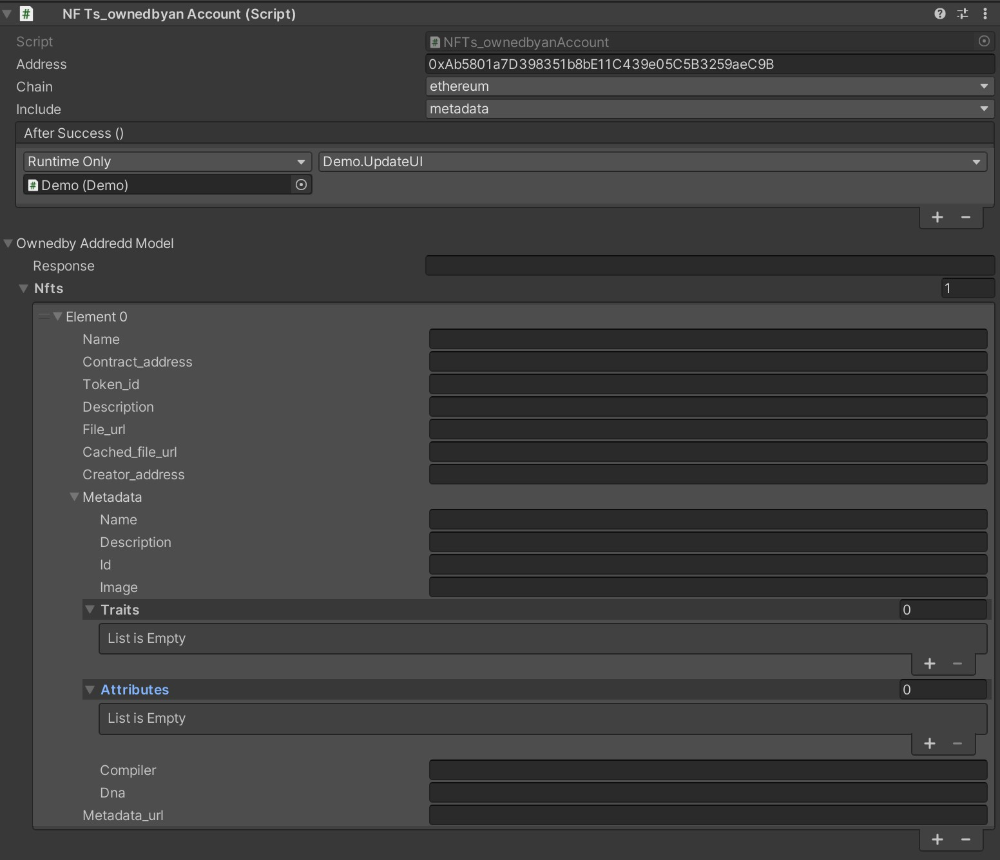
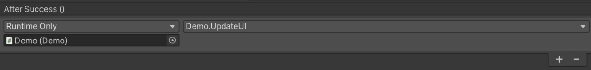

## Getting Started: 

- Get your API keys: Your API requests are authenticated using API keys. You can get your free API key from : https://www.nftport.xyz/sign-up

- Download Unity 2020.3.18f https://unity3d.com/unity/whats-new/2020.3.18 <br/>
  >*SDK is made using Unity 2020.3.18f , however is compatible with other versions as well. We'll be working towards Unity Asset Store release to make process easier.*

- Download NFT Port extension: <br/>
You can clone [this repo](https://github.com/nftport/nftport-unity) and open the [unity project](./NFT_UnitySDK) ,<br/>
alternatiivevly you may download the unity package and import in your project, <br/>
or copy the [NFT_UnitySDK Folder](./NFT_UnitySDK/Assets/NFTPort%20SDK) in your project Assets directory.<br/>

<br/>

## First Steps inside Unity:
- Setup your NFTPort API Key in Window / NFTPort <br/>

 <br/>
*best way to learn is by doing, a basic demo scene has been provided for play, view demo.cs*

<br/>


## Quick Usage via NFTPort_Interface.cs:

Add NFTPort_Interface.cs in your scene.<br/>

  <br/>
> NFTPort_Interface provides a globally accessible class which routes into individual components. You can only have one of this in your scene, other instances will get deleted at runtime. Adding NFTPort_Interface.cs will automatically add other required components. <br/>

In your script, Include 
```
using NFTPort;
```
Getting All Addresses Of an NFT: 
```
NFTPort_Interface.Instance.NFTsOfAccount(addressString);
```
Getting All NFT's of a Contract:
```
NFTPort_Interface.Instance.NFTsFromContract(ContractString);
```
Easy Mint NFT via URL:
```
NFTPort_Interface.Instance.Mint(FileUrlString, AddressString, NFTMintNameString);
```


>If you do not need to change chain ID at runtime, you can get most done by above and set the chain id and include parameters in the inspector on individual components.

When you call general functions  above using NFTPort_Interface.cs, the data gets sorted according to each NFT and populated in model of the following individual components below it, as seen in Unity Inpector Window. Any further actions utilising this data can be refrenced from these scripts. You can also link events from these individual components (view editor window of components(on object NNFTPort) in demo scene and demo.cs) <br/>

```
NFTsOwnedbyanAccount._ownedbyAddreddModel.nfts[i].name;
```


<br/>


## Individual Components:
###### Use Fetched Data : Modify chains, ID , Settings and more:

### NFTs_ownedbyanAccount.cs
>Component provides All NFT's owned by the account.  <br/>
 <br/>


#### Setting up Variables and Run()<br/>
These can be setup directly through inspector. 
For Runtime or setting up through script following can be used by refrencing the component, in this example as : _NFTsOwnedbyanAccount .
```
_NFTsOwnedbyanAccount.Address = "0xAb5801a7D398351b8bE11C439e05C5B3259aeC9B";
_NFTsOwnedbyanAccount.chain = "ethereum";
_NFTsOwnedbyanAccount.include = "all";
```

```
_NFTsOwnedbyanAccount.Run();
```
<br/>
Any events after a successful fetch can be done via:


##### Other Individual components can be used in similar fashion. 


# Whats next?
### Time to BUIDL. 
*we will be iterating this extension and this is meant to provide a starter pack and tools in your journey with NFTPort and Unity3D. NFT's and GameEngines opens up a huge metaverse of creativity where possibilities are endless! What will you build?* 

NFTPort has a number of api endpoints available at: https://docs.nftport.xyz/docs/nftport 

# Join the community :
Get support, showcase your work, share your thoughts and feedback, and engage in a vibrant community at:
https://discord.gg/w92sXkNmBR 

###### for your gaming endeavors, get in touch at sahaj@nftport.xyz
